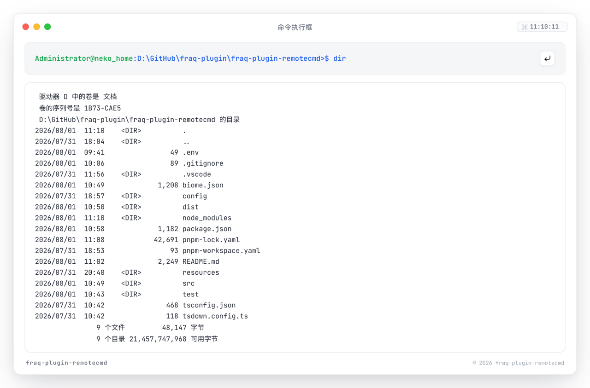
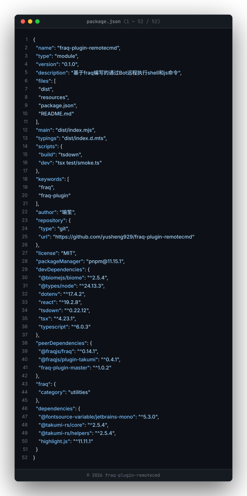

# fraq-plugin-remotecmd

基于 [fraq](https://fraq.dev) 的远程命令插件：通过 Bot 远程执行 Shell / JavaScript 命令，并将执行结果或代码片段渲染为图片回复。

## 功能

| 命令 | 说明 |
| --- | --- |
| `rjs <code>` | 在 vm 沙盒中执行 JavaScript（30 秒超时），沙盒内可访问 fraq API、`ctx`、`session` 等 |
| `rc <cmd>` | 执行 Shell 命令，以终端提示符风格的纯文本回复 |
| `rcp <cmd>` | 执行 Shell 命令，渲染为 macOS 窗口风格图片回复（还原 ANSI 颜色、识别日志级别高亮）¹ |
| `sc <文件路径> [起始行] [~结束行]` | 将代码文件片段渲染为带语法高亮和行号的图片，如 `sc src/index.ts 10~30`¹ |

¹ 需要安装可选依赖 `@fraqjs/plugin-takumi`；未安装时 `rcp` 自动回退为文本回复，`sc` 不可用。

所有命令仅 Master 可用（由 [fraq-plugin-master](https://github.com/yusheng929/fraq-plugin-master) 获取主人列表）。

### 效果预览

`rcp` 命令执行效果：



`sc` 代码快照效果：



 效果以实际使用为准

## 安装与配置

将插件添加到 `fraq.yml` 的 `plugins` 字段下：

```yaml
plugins:
  remotecmd:
```

本插件依赖 [fraq-plugin-master](https://github.com/yusheng929/fraq-plugin-master) 提供 Master 判定，需一并添加：

```yaml
plugins:
  master:
  remotecmd:
```

图片渲染功能（`rcp` / `sc` 命令）由 [@fraqjs/plugin-takumi](https://fraq.dev/docs/plugins/takumi) 提供，为可选依赖，需要时一并添加：

```yaml
plugins:
  master:
  fraqjs/takumi:
  remotecmd:
```

未安装 `fraqjs/takumi` 时插件可正常加载，`rc` / `rjs` 不受影响，`rcp` 回退为文本回复。

注意：`@fraqjs/plugin-takumi` 依赖 Takumi 原生渲染器，仅支持 Windows / macOS / Linux 的 x64 与 arm64 平台。

## 本地开发

```bash
pnpm install
pnpm build   # 使用 tsdown 构建到 dist/
pnpm dev     # 运行 test/smoke.ts 连接真实环境调试
```

`pnpm dev` 需要在项目根目录创建 `.env` 文件：

```env
URL=http://127.0.0.1:7003
TOKEN=访问令牌
```

## 实现说明

- 图片渲染由 Takumi 完成：HTML 模板（`resources/`）经占位符插值后交给 `fromHtml` 解析渲染为 PNG，样式通过 `<link>` 声明并在渲染时内联
- 代码高亮使用 highlight.js，输出行识别 WARN / ERR / 成功等关键词着色，ANSI 颜色序列还原为 HTML span
- Windows 中文系统的 Shell 输出自动从 GBK 回退解码

## License

MIT
